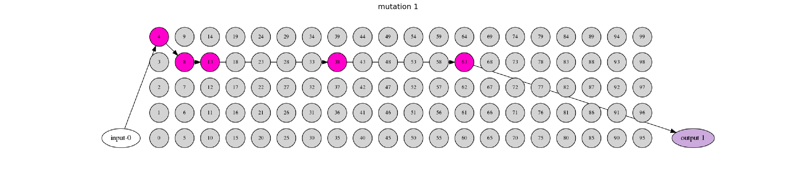

# Cartesian Genetic Programming for CNN Design

As part of my master thesis I'm trying to find an approach to optimize CNN architectures. To be more accurate
case of my  thesis a architecture which is not too complex and able to run in real time on embedded devices. 
I've found the paper *A Genetic Programming Approach to Designing Convolutional Neural Network Architectures* 
and this repository is my implementation. In this approach it uses a special form of Genetic Programming, it is 
called Cartesian Genetric Programming.    

## Visualization
A simple example what happens when the CGP algorithm is used. Each frame is a mutation of a gene.

## References
- [Cartesian Genetic Programming](http://www.cartesiangp.co.uk/)
- [A Genetic Programming Approach to Designing Convolutional Neural Network Architectures](https://arxiv.org/abs/1704.00764)